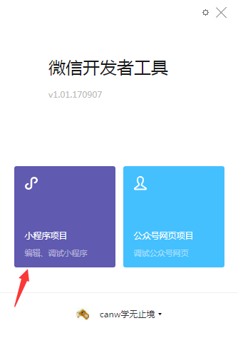
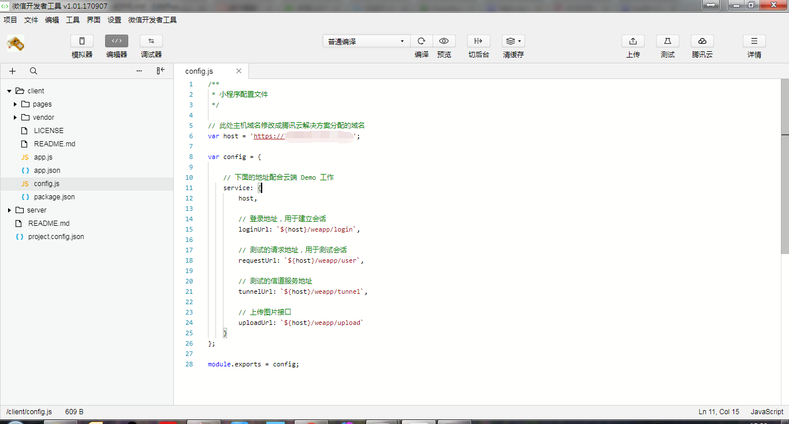

自行布署Wafer2服务器及测试DEMO教程
======================

一、准备工作
-----------
* 已经注册了微信小程序。
* 经注册了腾讯的域名。
* 已经购买了腾讯云的Wafer服务器。包括
1. 一台业务服务器(CentOS 7.2 64位)
2. 一台会话服务器CentOS 7.2 64位)
3. 一台mysql服务器(MySQL5.6)

二、收集要用到的配置信息
------------------------
1. <a href="https://mp.weixin.qq.com">登录微信公众平台｜小程序</a>,依次点击"设置->开发者设置"，将你的AppID记录下来备用;   
点击"AppSecret(小程序密钥)"右侧的重置按钮，按提示查看并记录"AppSecret(小程序密钥)"。  
  
    AppID: wx8afbcb404a881234
    AppSecret: e6647df40ecca5996c77b77d05c91234

2. <a href="https://console.qcloud.com/">登录腾讯云</a>,分别记录业务服务器的公网IP，内网IP，会话服务器的公网IP和内网IP，微信小程序数据库MySQL的内网地址。例如：

	会话服务器：139.199.119.217(公) 172.215.0.80(内)
	
	业务服务器：123.207.152.208(公) 172.215.0.110(内)
	
	数据库服务器：172.21.120.135(内)

三、配置服务器
--------------
1. 业务服务器配置
-----------------

	重新安装操作系统
	通过ssh客户端登录
	yum install git
	wget https://nodejs.org/dist/v8.4.0/node-v8.4.0-linux-x64.tar.xz
	tar zxf node-v8.4.0-linux-x64.tar.xz
	mv node-v8.4.0-linux-x64 /opt/node
	cd /data/release/server
	npm install
	npm install pm2 -g
	node tools/initdb.js

	修改这几个文件中标注“//*”的部分。十分重要！！
	/data/release/server/config.js
	/data/release/sdk.config.json

2. 会话服务器配置
-----------------

	重新安装操作系统
	通过ssh客户端登录
	cd /opt/lampp/htdocs
	./update_mina.sh
	/opt/lampp/htdocs/mina_auth/system/db/db.ini

	只有这三荐内容根据需要修改
	host = 172.211.0.105 你的mysql服务器内网IP
	user_name = root  你的mysql服务器用户名
	pass_wd = mysqlpass 你的mysql服务器密码

四、下载微信开发者工具软件
-------------------------
请点击如下网址，根据自己的电脑操作系统，下载对应平台的微信开发者工具软件，并安装：   
https://mp.weixin.qq.com/debug/wxadoc/dev/devtools/download.html   

运行开发工具，会提示用微信扫描登录。使用微信扫描，登录并授权   
   
在接下来的界面中选择小程序项目。   
   
https://mp.weixin.qq.com   

在编辑器中打开 /client/config.js   
把文件中下行的 xxx.xxx.xxx修改为你申请的域名   
var host = 'https://xxx.xxx.xxx';   

点编译就可进行测试了。   
